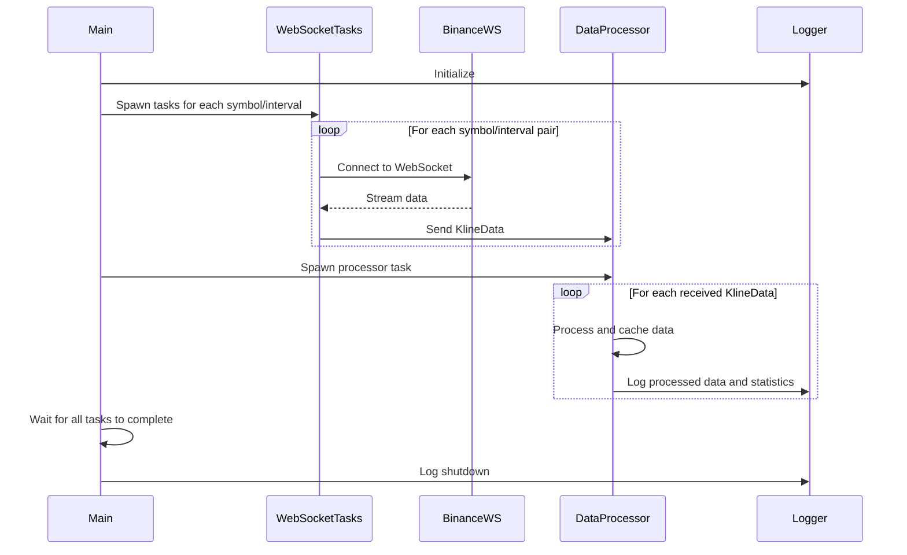

# Crypto Kline Tracker

This is a distributed and parallel Rust application that connects to the Binance WebSocket API to stream real-time cryptocurrency price data for multiple symbols and intervals simultaneously.

## Features

- Connects to multiple Binance WebSocket streams concurrently
- Processes kline (candlestick) data for various cryptocurrency pairs and time intervals
- Utilizes parallel processing for data handling
- Implements comprehensive logging for better debugging and monitoring
- Calculates and displays average price changes across all tracked symbols

## Prerequisites

- Rust (latest stable version)
- Cargo (Rust's package manager)

## Setup

1. Clone this repository:
   ```
   git clone https://github.com/arturogonzalezm/crypto_kline_tracker.git
   cd crypto_kline_tracker
   ```

2. Add the following dependencies to your `Cargo.toml`:
   ```toml
   [dependencies]
   tokio = { version = "1.40.0", features = ["full"] }
   tokio-tungstenite = { version = "0.24.0", features = ["native-tls"] }
   futures-util = "0.3"
   url = "2.2"
   tui = "0.19"
   crossterm = "0.28.1"
   serde_json = "1.0.128"
   reqwest = { version = "0.12.7", features = ["json"] }
   chrono = "0.4.38"
   anyhow = "1.0.89"
   rayon = "1.10.0"
   log = "0.4.22"
   env_logger = "0.11.5"
   ```

3. Build the project:
   ```
   cargo build --release
   ```

## Usage

To use the logged version of the application:

1. Ensure you've added the new dependencies (`log` and `env_logger`) to your `Cargo.toml` as shown in the Setup section.

2. Run the application with different log levels using the `RUST_LOG` environment variable. For example:
   - `RUST_LOG=info cargo run` for standard information logging
   - `RUST_LOG=debug cargo run` for more detailed debug information
   - `RUST_LOG=warn cargo run` to see only warnings and errors

3. The application will start connecting to the Binance WebSocket streams for the predefined symbols and intervals.

4. You'll see real-time updates and average price changes in the console output, with the verbosity determined by your chosen log level.

5. To stop the application, press `Ctrl+C`.

## Configuration

You can modify the symbols and intervals in the `main()` function:

```rust
let symbols = &["btcusdt", "ethusdt", "bnbusdt", "adausdt", "dogeusdt"];
let intervals = &["1m", "5m", "15m"];
```

## Application Flow

The following Mermaid sequence diagram illustrates the high-level flow of the application:



This diagram shows how the main function spawns multiple WebSocket tasks, each connecting to a Binance WebSocket stream. These tasks then send the received data to a central DataProcessor, which processes and logs the information.

## Error Handling

The application uses the `anyhow` crate for error handling. Any errors during WebSocket connections or data processing are logged with the appropriate context.

## Logging

Logging is implemented using the `log` and `env_logger` crates. You can adjust the log level using the `RUST_LOG` environment variable to control the verbosity of the output.

## Performance Considerations

- The application uses Tokio for asynchronous I/O, allowing it to handle multiple WebSocket connections efficiently.
- Rayon is used for parallel processing of the received data, utilizing multiple CPU cores when available.
- Be mindful of the number of symbols and intervals you're tracking, as each combination creates a separate WebSocket connection.

## Contributing

Contributions are welcome! Please feel free to submit a Pull Request.

## License

This project is licensed under the MIT License - see the LICENSE file for details.
