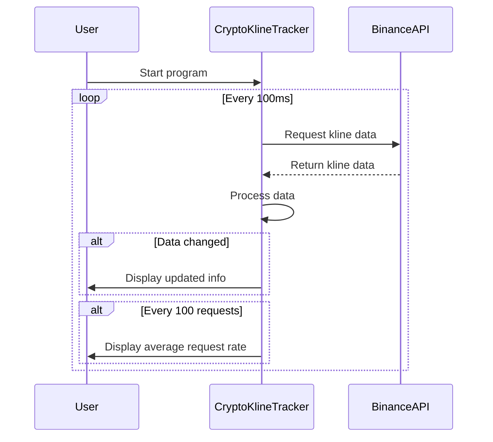

# Crypto Kline Tracker

Crypto Kline Tracker is a Rust-based application that provides real-time monitoring of cryptocurrency price data using the Binance API. It retrieves and displays candlestick (kline) data for a specified cryptocurrency pair at high frequency.

## Features

- Real-time tracking of cryptocurrency price data
- High-frequency data retrieval (up to 10 requests per second)
- Displays comprehensive information including open, high, low, close prices, and volume
- Calculates and shows price changes and percentage changes
- Tracks the number of updates per interval
- Provides average request rate statistics

## Prerequisites

Before you begin, ensure you have met the following requirements:

- Rust programming language (latest stable version)
- Cargo package manager

## Installation

1. Clone the repository:
   ```
   git clone https://github.com/arturogonzalezm/crypto_kline_tracker.git
   cd crypto_kline_tracker
   ```

2. Build the project:
   ```
   cargo build --release
   ```

## Usage

To run the Crypto Kline Tracker:

```
cargo run --release
```

By default, the application tracks the BTCUSDT pair with a 1-minute interval. To modify the tracked pair or interval, edit the `symbol` and `interval` variables in the `main` function.

## Configuration

You can customise the following parameters in the `main` function:

- `symbol`: The cryptocurrency pair to track (e.g., "BTCUSDT", "ETHUSDT")
- `interval`: The candlestick interval (e.g., "1m" for 1 minute, "5m" for 5 minutes)

## Output

The application provides real-time output in the following format:

```
Local time: YYYY-MM-DD HH:MM:SS | Interval start: YYYY-MM-DD HH:MM | Open: X.XX | High: X.XX | Low: X.XX | Close: X.XX | Volume: X.XX | Change: X.XX (X.XX%) | Updates: N
```

Every 100 requests, it also displays the average request rate:

```
Average request rate: X.XX requests/second
```

## Program Flow

The following sequence diagram illustrates the flow of the Crypto Kline Tracker:



This diagram shows how the program continuously requests data from the Binance API, processes it, and displays updates to the user.

## Contributing

Contributions to the Crypto Kline Tracker are welcome. Please feel free to submit a Pull Request.

## License

This project is licensed under the MIT License - see the LICENSE file for details.

## Disclaimer

This application is for educational and informational purposes only. It is not financial advice. Please use it responsibly and be aware of the risks associated with cryptocurrency trading.
